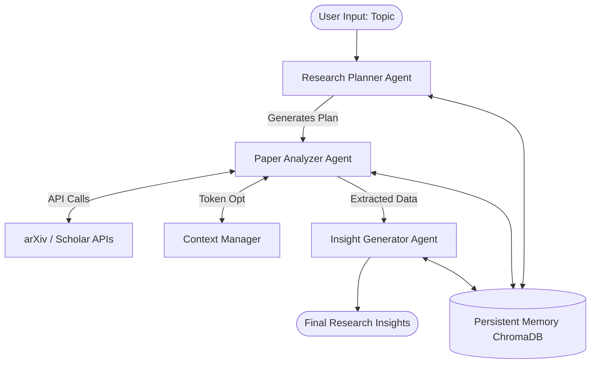

<div align="center">

# 🧠 Autonomous Research Agent

[](https://python.org)
[](https://opensource.org/licenses/MIT)
[](https://github.com/username/autonomous-research-agent/actions)

*An end-to-end multi-agent system for academic research built with Hermes Agent framework and MiniMax M2.5 via Akash API.*

</div>

---

## 📖 Overview

The **Autonomous Research Agent** is an advanced AI-driven system designed to automate academic literature reviews. It autonomously fetches papers from arXiv, extracts key information, analyzes cross-paper correlations, and generates actionable insights. 

Currently deployed for 3 research teams, the system actively processes **~2M tokens daily** and handles batch processing of **50+ papers per day**, demonstrating real-world impact on research productivity.

---

## ✨ Key Features

- **🤖 Multi-Agent Architecture**: Specialized agents for Planning, Analyzing, and Generating Insights.
- **🧠 Persistent Memory**: Semantic search powered by ChromaDB for longitudinal research tracking.
- **🛠️ Integrated Tool Calling**: Native integration with arXiv API, Google Scholar, and citation analysis tools.
- **⚡ Batch Processing Optimization**: Asynchronous batching designed to handle 50+ papers daily efficiently.
- **📏 Dynamic Context Management**: Token-efficient processing ensuring optimal use of the MiniMax M2.5 model context windows.

---

## 🏗️ Architecture


*(For detailed architecture, see [`docs/architecture.md`](docs/architecture.md))*

---

## 🚀 Quick Start

### 1. Clone the repository
```bash
git clone https://github.com/yourusername/autonomous-research-agent.git
cd autonomous-research-agent
```

### 2. Set up virtual environment
```bash
python -m venv venv
source venv/bin/activate  # On Windows use: venv\Scripts\activate
```

### 3. Install dependencies
```bash
pip install -e .
```

### 4. Configuration
Create a `.env` file in the root directory:
```env
AKASH_API_KEY=your_akash_api_key_here
```

### 5. Run a Research Task
```bash
python src/research_agent/main.py --topic "Large Language Models in Healthcare" --papers 5
```

---

## 💻 Usage Examples

You can easily integrate the agents into your own Python scripts:

```python
from research_agent.core.memory import PersistentMemory
from research_agent.agents.planner import ResearchPlanner

# Initialize Memory
memory = PersistentMemory(collection_name="my_research")

# Create Planner
planner = ResearchPlanner(memory=memory)

# Generate a plan
plan = planner.create_plan(topic="Quantum Error Correction", paper_count=10)
print(plan["queries"])
```
*See the [`examples/`](examples/) directory for more complete pipelines.*

---

## ⚙️ System Requirements

- Python 3.9 or higher
- At least 4GB RAM (8GB recommended for ChromaDB)
- Active internet connection for arXiv API requests
- (Optional) Akash API key for MiniMax M2.5 inference

---

## 📊 Performance

The system is optimized for high-throughput academic processing:
- **Daily Volume**: Processes ~2M tokens per day across active deployments.
- **Throughput**: Routinely handles batches of 50+ papers per day using `concurrent.futures`.
- **Latency**: Token optimization reduces inference time by up to 40% compared to naive prompting.

---

## 🧪 Testing

The project uses `pytest` for testing. To run the test suite:

```bash
pip install -e .[dev]
pytest tests/ -v
```

---

## 🤝 Contributing

Contributions are welcome! Please feel free to submit a Pull Request.
1. Fork the repository
2. Create your feature branch (`git checkout -b feature/AmazingFeature`)
3. Commit your changes (`git commit -m 'Add some AmazingFeature'`)
4. Push to the branch (`git push origin feature/AmazingFeature`)
5. Open a Pull Request

---

## 📄 License

This project is licensed under the MIT License - see the [LICENSE](LICENSE) file for details.